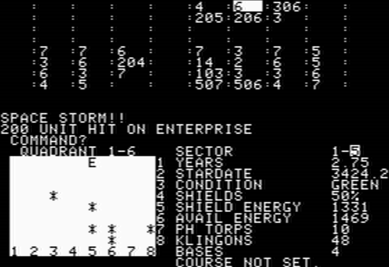

# STARTREK

### For the APPLE II computer by W SANDER, January 1978





This is the source code of one of the oldest game for the Apple II and also one of the best text only STARTREK version one can play : it features animations and sounds !

Needs the INTEGER BASIC ROMS.  
**Note :** despite being able to run it, [reinette-II](https://github.com/ArthurFerreira2/reinette-II) does not support sound and [LinApple](https://github.com/linappleii/linapple) or [AppleWin](https://github.com/AppleWin/AppleWin) are recommended.


The original source embeded a binary routine at $3FA1 to play various sound effects, followed by some mysterious data :

```
3FA1-   A0 32       LDY   #$32  
3FA3-   A2 00       LDX   #$00  
3FA5-   8A          TXA  
3FA6-   18          CLC  
3FA7-   E9 01       SBC   #$01  
3FA9-   D0 FC       BNE   $3FA7  
3FAB-   8D 30 C0    STA   $C030  
3FAE-   E8          INX  
3FAF-   E0 03       CPX   #$03  
3FB1-   D0 F2       BNE   $3FA5  
3FB3-   88          DEY  
3FB4-   D0 ED       BNE   $3FA3  
3FB6-   60          RTS  
<some data following>
```

First, you have to load it from the monitor (`CALL -151`) using :  

```
3FA1: A0 32 A2 00 8A 18 E9 01 D0 FC 8D 30 C0 E8
:E0 03 D0 F2 88 D0 ED 60 EB 60 C1 01 45 20 4E 5D
:B4 B4 B4 B4 B4 B4 B4 B4 5A 87 99 A2 A6 A9 AB AC
:5A 75 87 92 99 9E A2 A4 5A 6C 7C 87 8F 95 99 9D
:5A 68 75 7F 87 8D 92 96 5A 65 70 79 81 87 8C 90
:5A 63 6C 75 7C 82 87 8B 5A 62 6A 71 78 7E 83 87
:01
```

Then jump to basic by hitting `CTRL-B` and `ENTER`  
Copy paste the BASIC source code  
and type `RUN`  


### From [Apple II Reference Manual January 1978, page 3](https://archive.org/details/Apple_II_Redbook/page/n5) :

```
Running 16K Startrek

If you have 16K Bytes or larger memory in your Apple, you will also
receive a "STARTREK" game tape. Load this program just as you did
the previous two, but before you "RUN" it, type in "HIMEM: 16384"
to set exactly where in memory this program is to run.
```


### From [Apple II Reference Manual January 1978, page 14](https://archive.org/details/Apple_II_Redbook/page/n16) :  

```
       -.-.-.-.-.-.-.-.-    APPLE II  STARTREK VERSION  -.-.-.-.-.-.-.-.-.-.-

             THIS IS A SHORT DESCRIPTION OF HOW TO PLAY STARTREK ON THE
       APPLE COMPUTER.
         THE UNIVERSE IS MADE UP OF 64 QUADRANTS IN AN 8 BY 8 MATRIX.
         THE QUADRANT IN WHICH YOU 'THE ENTERPRISE ' ARE, IS IN WHITE,
         AND A BLOW UP OF THAT QUADRANT IS FOUND IN THE LOWER LEFT
         CORNER.   YOUR SPACE SHIP STATUS IS FOUND IN A TABLE TO
         THE RIGHT SIDE OF THE QUADRANT BLOW UP.
            THIS IS A SEARCH AND DESTROY MISSION.   THE OBJECT IS TO LONG-RANGE
       SENSE FOR INFORMATION AS TO WHERE KLINGONS (K) ARE, MOVE TO THAT QUADRANT,
       AND DESTROY.
              NUMBERS DISPLAYED FOR EACH QUADRANT DENOTE:
                                          * OF STARS IN THE ONES PLACE
                                          * OF BASES IN THE TENS PLACE
                                          * OF KLINGONS IN THE HUNDREDS PLACE
           AT ANY TIME DURING THE GAME, FOR INSTANCE BEFORE ONE TOTALLY
      RUNS OUT OF ENERGY, OR NEEDS TO REGENERATE ALL SYSTEMS, ONE MOVES TO A
      QUADRANT WHICH INCLUDES A BASE, IONS NEXT TO THAT BASE (B) AT WHICH TIME
      THE BASE SELF-DESTRUCTS AND THE ENTERPRISE (E) HAS ALL SYSTEMS 'GO'
      AGAIN.

        TO PLAY:
       1.THE COMMANDS CAN BE OBTAINED BY TYPING A '0' (ZERO) AND RETURN.
        THEY ARE:
                     1. PROPULSION           2.REGENERATE
                     3. LONG RANGE SENSORS   4. PHASERS
                     5. PHOTON TORPEDOES     6. GALAXY RECORD
                     7. COMPUTER             8. PROBE
                     9. SHIELD ENERGY        10.DAMAGE REPORT
                     11.LOAD PHOTON TORPEDOES
       2.THE COMANDS ARE INVOKED BY TYPING 1HE NUMBER REFERING TO THEM
             FOLLOWED BY A 'RETURN'.
             A.IF RESPONSE IS 1 THE COMPUTER WILL ASK WARP OR ION AND
                    EXPECTS 'W' IF ONE WANTS TO TRAVEL IN THE GALAXY
                    BETWEEN QUADRANTS AND AN 'I' IF ONE WANTS ONLY
                    INTERNAL QUADRANT TRAVEL.
                    DURATION OF WARP FACTOR IS THE NUMBER OF SPACES OR
                    QUADRANTS THE ENTERPRISE WILL MOVE.
                    COURSE IS COMPASS READING IN DEGREES FOR THE DESI-
                    RED DESTINATION.
             B.A 2 REGENERATES THE ENERGY AT 1HE EXPENSE OF TIME.
             C.A 3 GIVES THE CONTENTS OF THE IMMEDIATE. ADJACENT QUADRANTS.
                    THE GALAXY IS WRAP-AROUND IN ALL DIRECTIONS.
             D.4 FIRES PHASERS AT THE EXPENSE OF AVAILABLE ENERGY.
             
             
             E.5 INITIATES A SET OF QUESTIONS FOR TORPEDO FIRING.
                    THEY CAN BE FIRED AUTOMATICALLY IF THEY HAVE
                    BEEN LOCKED ON TARGET WHILE IN THE COMPUTER
                    MODE, OR MAY BE FIRED MANUALLY IF THE TRAGECTORY ANGLE
                    IS KNOWN.
            F.6, 8 AND 10 ALL GIVE INFORMATION ABOUT THE STATUS OF THE SHIP
                    AND ITS ENVIRONMENT.
           G.9 SETS THE SHIELD ENERGY/AVAILABLE ENERGY RATIO.
           H.11 ASKS FOR INFORMATION ON LOADING AND UNLOADING OF
                    PHOTON TORPEDOES AT THE ESPENSE OF AVAILABLE ENERGY.
                            THE ANSWER SHOULD BE A SIGNED NUMBER. FOR EXAMPLE
                            +5 OR -2.
           I. 7 ENTERS A COMPUTER WHICH WILL RESPOND TO THE FOLLOWING
                   INSTRUCTIONS:
                           1. COMPUTE COURSE   2.LOCK PHASERS
                           3.LOCK PHOTON TORPEDOES
                           4.LOCK COURSE       5. COMPUTE TREJECTORY
                           6.STATUS            7. RETURN TO COMAND MODE
                   IN THE FIRST FIVE ONE WILL HAVE TO GIVE COORDINATES.
                   COORDINATES ARE GIVEN IN MATHMATICAL NOTATION WITH
                   THE EXCEPTION THAT THE 'Y' VALUE IS GIVEN FIRST.
                   AN EXAMPLE WOULD BE 'Y,X'
                   
                   COURSE OR TRAJECTORY:

                                   0
                                   |
                                   |
                                   |
                                   |
                   270-------------+---------------90
                                   |
                                   |
                                   |
                                   |
                                  180
   -.-.-.-.-.-.-.- THIS EXPLANATION WAS WRITTEN BY ELWOOD -.-.-.-.-.-.-.-.-
                           NOT RESPONSIBLE FOR
                                   ERRORS        
```


